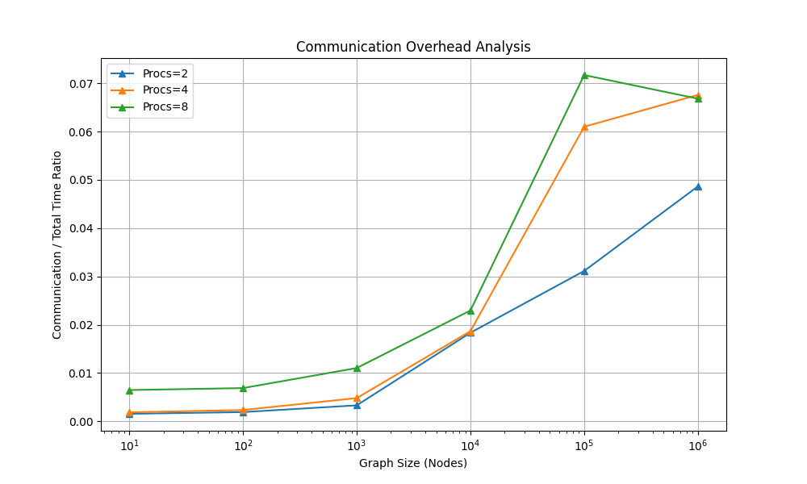
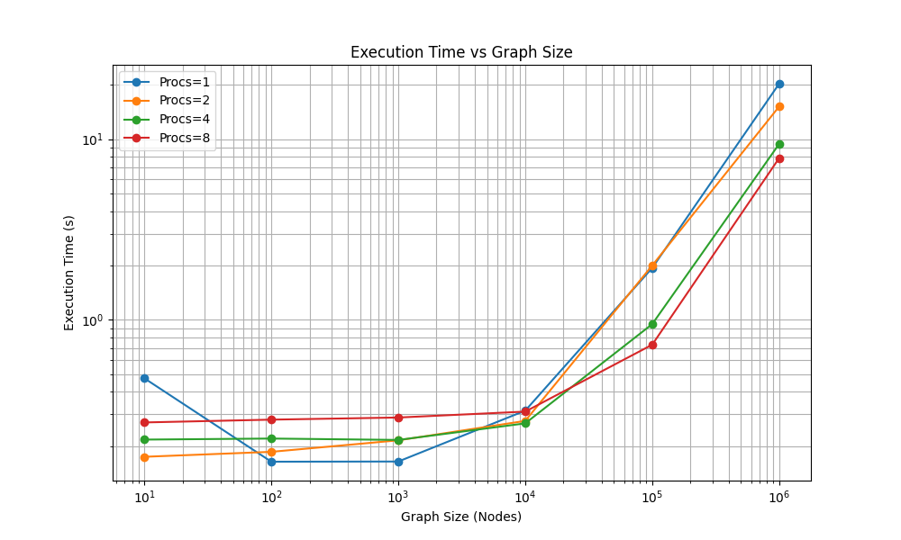
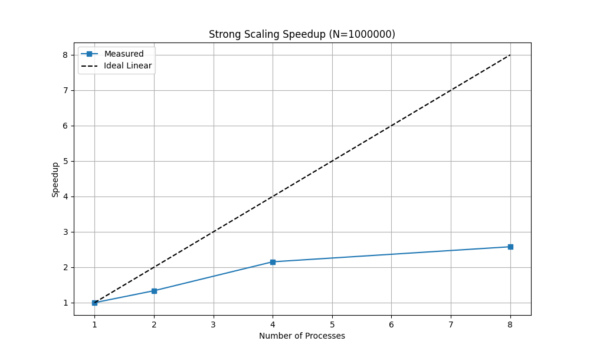

# Parallel Efficiency Analysis
## Execution time with different numbers of MPI processes (1, 2, 4, 8)
Reference Time (N=1000000, P=1): 20.2712s
Procs=2: Speedup=1.34x, Efficiency=66.86%
Procs=4: Speedup=2.15x, Efficiency=53.87%
Procs=8: Speedup=2.58x, Efficiency=32.25%

## Scaling
Algorithm: Label Propagation
Theoretical Complexity: O(k * (n + m)) per iteration.
Measured Scaling (P=1):
N=10: 0.4750s (1.4 avg iters) -> 4.75e-02 sec/node
N=100: 0.1641s (3.2 avg iters) -> 1.64e-03 sec/node
N=1000: 0.1645s (5.4 avg iters) -> 1.65e-04 sec/node
N=10000: 0.3146s (7.6 avg iters) -> 3.15e-05 sec/node
N=100000: 1.9376s (9.4 avg iters) -> 1.94e-05 sec/node
N=1000000: 20.2712s (10.8 avg iters) -> 2.03e-05 sec/node

## Maximum graph size processable within 10-minute limit
Approximately 76365000 nodes (assuming 8 processes and taking the 2.03e-05 sec/node for 1e6 nodes)

## Time spent in MPI communication primitives
Procs=2, N=1000000: Comm overhead is 4.9%
Procs=4, N=1000000: Comm overhead is 6.8%
Procs=8, N=1000000: Comm overhead is 6.7%

